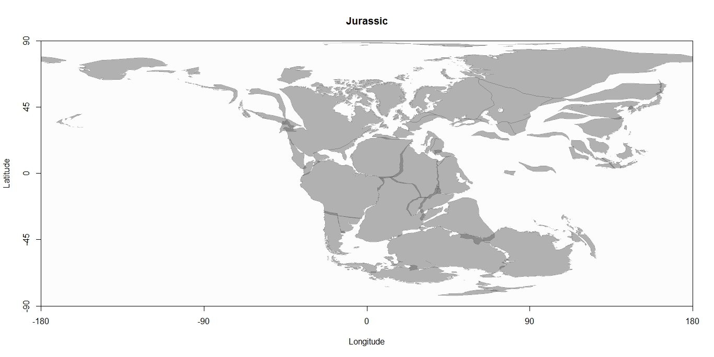
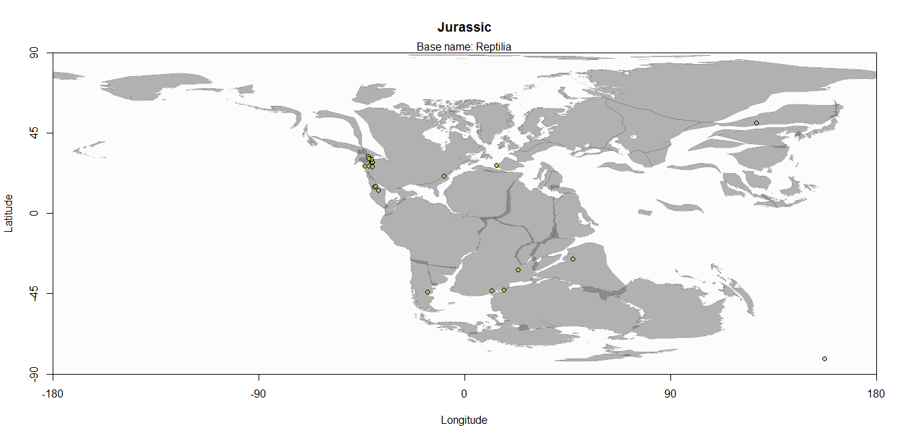
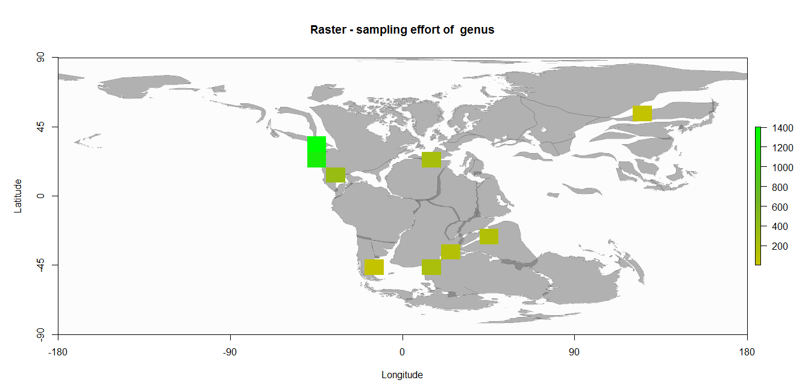
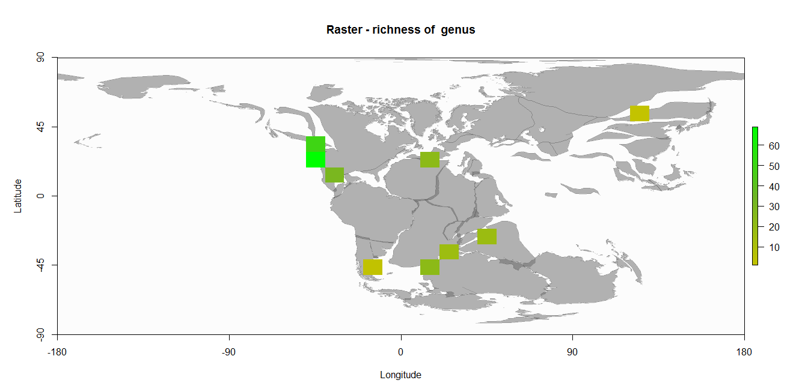
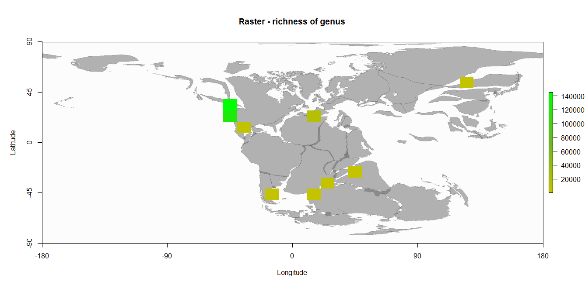

[](https://travis-ci.org/macroecology/paleoMap)

paleoMap
=======

### About

`paleoMap` is a package for downloading, visualizing and processing data from [Paleobiology Database](http://paleobiodb.org/) combined with maps from [GPlates](http://www.gplates.org/).


### Quick start

**Install**

Install paleoMap from CRAN

```coffee
install.packages("paleoMap")
library(paleoMap)
```

Install paleoMap developing version from github

```coffee
install.packages("devtools")
library(devtools)
install_github("NonaR/paleoMap")
library(paleoMap)
```

**General overview**

`paleoMap` version xx has 3 functions for getting and visualising paleogeographical maps and fossil data, 
5 functions for doing paleogeographical analyses and 2 functions for biodversity analyses.


## Get and visualise paleogeograhical maps and fossil data

**pm_getmap** 
returns the shapefile of a choosen paleogeographical time interval

```coffee
> shape  <-  pm_getmap(interval="Jurassic", do.plot=TRUE)
> shape
```

```coffee
##class       : SpatialPolygonsDataFrame 
##features    : 77 
##extent      : -180, 180, -82.9491, 89.0674  (xmin, xmax, ymin, ymax)
##coord. ref. : NA 
##variables   : 13
##names       : PLATEID1,               GPGIM_TYPE, TYPE, FROMAGE, TOAGE, NAME, DESCR,                                   FEATURE_ID, PLATEID2, L_PLATE, R_PLATE, RECON_METH, SPREAD_ASY 
##min values  :        0, gpml:UnclassifiedFeature,   NA,       0,     0,   NA,    NA, GPlates-049b54d5-0c8d-4c48-ab2c-c01af79bb31f,        0,       0,       0,         NA,          0 
##max values  :        0, gpml:UnclassifiedFeature,   NA,       0,     0,   NA,    NA, GPlates-f6cb6ad6-6c48-42f0-a1c2-52badd007c73,        0,       0,       0,         NA,          0 
```



**pm_getdata**
returns the needed parameter of the fossil record

```coffee
> data  <-  pm_getdata (base_name="Reptilia", interval="Jurassic", limit=50)
> head(data)
```

```coffee
             matched_name   matched_rank early_interval  late_interval paleolng paleolat geoplate
##1   Chaoyangsaurus youngi        species Late Tithonian    Valanginian   127.48    50.66      604
##2   Chaoyangsaurus youngi        species Late Tithonian    Valanginian   127.48    50.66      604
##3               Theropoda unranked clade     Hettangian     Sinemurian    -9.08    21.08      101
##4               Theropoda unranked clade     Hettangian     Sinemurian    -9.08    21.08      101
##5 Amygdalodon patagonicus        species  Late Toarcian Early Aalenian   -16.23   -44.08      291
##6 Amygdalodon patagonicus        species  Late Toarcian Early Aalenian   -16.23   -44.08      291
##           genus           family     order        class   phylum
##1 Chaoyangsaurus Chaoyangsauridae      <NA> Ornithischia Chordata
##2 Chaoyangsaurus Chaoyangsauridae      <NA> Ornithischia Chordata
##3           <NA>             <NA> Theropoda   Saurischia Chordata
##4           <NA>             <NA> Theropoda   Saurischia Chordata
##5    Amygdalodon             <NA>      <NA>   Saurischia Chordata
##6    Amygdalodon             <NA>      <NA>   Saurischia Chordata
```

**pm_plot**
Returns a map with the fossil occurrences.

```coffee
> pm_plot (interval="Jurassic", base_name= "Reptilia", limit=50)
```



## Functions for paleogeographical analyses

**pm_occraster**
Returns a RasterLayer of the sampling effort and a map with the raster on it.

```coffee
> shape <- pm_getmap(interval="Jurassic") 
> data <- pm_getdata (base_name="Reptilia", interval="Jurassic", limit=50)
> pm_occraster (shape, data)
``` 

```coffee
##class       : RasterLayer 
##dimensions  : 17, 36, 612  (nrow, ncol, ncell)
##resolution  : 10, 10  (x, y)
##extent      : -180, 180, -80.9326, 89.0674  (xmin, xmax, ymin, ymax)
##coord. ref. : NA 
##data source : in memory
##names       : layer 
##values      : 3, 1405  (min, max)
```

 

**pm_richraster**
Returns a RasterLayer of richness and a map with the raster on it.

```coffee
> shape <- pm_getmap(interval="Jurassic") 
> data <- pm_getdata (base_name="Reptilia", interval="Jurassic", limit=50)
> pm_richraster (shape, data, rank="genus")
``` 

```coffee
##class       : RasterLayer 
##dimensions  : 17, 36, 612  (nrow, ncol, ncell)
##resolution  : 10, 10  (x, y)
##extent      : -180, 180, -80.9326, 89.0674  (xmin, xmax, ymin, ymax)
##coord. ref. : NA 
##data source : in memory
##names       : layer 
##values      : 1, 69  (min, max)
```

 


**pm_corrichraster**
Returns a corrected RasterLayer of richness and a map with the raster on it.

```coffee
> shape <- pm_getmap(interval="Jurassic") 
> data <- pm_getdata (base_name="Reptilia", interval="Jurassic", limit=50)
> ngl_data <- pm_ngl(data)
> pm_corrichraster (shape, ngl_data)
``` 

```coffee
##class       : RasterLayer 
##dimensions  : 17, 36, 612  (nrow, ncol, ncell)
##resolution  : 10, 10  (x, y)
##extent      : -180, 180, -80.9326, 89.0674  (xmin, xmax, ymin, ymax)
##coord. ref. : NA 
##data source : in memory
##names       : layer 
##values      : 1, 145291  (min, max)
``` 

 


**pm_ngl**
Calculates the number of genera per locality.

```coffee
> data <- pm_getdata (base_name="Reptilia", interval="Jurassic", limit=50)
> ngl_data <- pm_ngl (data)
> head(ngl_data)
```
```coffee
     paleolat paleolng Chaoyangsaurus Amygdalodon Camarasaurus Allosaurus Diplodocus Stegosaurus
##[1,]    50.66   127.48              2           0            0          0          0           0
##[2,]   -44.08   -16.23              0           2            0          0          0           0
##[3,]    26.59   -43.61              0           0            2          0          0           0
##[4,]    26.66   -42.07              0           0            2          0          0           0
##[5,]    28.58   -40.48              0           0            0          2          0           0
##[6,]    28.79   -40.71              0           0            2          6          2           2
     Scutellosaurus Rhamphinion Massospondylus Apatosaurus Gigantosauropus Hispanosauropus
##[1,]              0           0              0           0               0               0
##[2,]              0           0              0           0               0               0
##[3,]              0           0              0           0               0               0
##[4,]              0           0              0           0               0               0
##[5,]              0           0              0           0               0               0
##[6,]              0           0              0           0               0               0
     Brontosaurus Protosuchus Dilophosaurus Coelophysis Kotasaurus Camptosaurus Barosaurus Opisthias
##[1,]            0           0             0           0          0            0          0         0
##[2,]            0           0             0           0          0            0          0         0
##[3,]            0           0             0           0          0            0          0         0
##[4,]            0           0             0           0          0            0          0         0
##[5,]            0           0             0           0          0            0          0         0
##[6,]            0           0             0           0          0            0          0         0
     Eilenodon
##[1,]         0
##[2,]         0
##[3,]         0
##[4,]         0
##[5,]         0
```

**pm_nloc**
Calculates the number of localities per grid cell for different genera.

```coffee
> data <- pm_getdata (base_name="Reptilia", interval="Jurassic", limit=50)
> nloc <- pm_nloc (data, res=10)
> head(nloc)
```

```coffee
        -180;-170 -170;-160 -160;-150 -150;-140 -140;-130 -130;-120 -120;-110 -110;-100 -100;-90
##-90;-80         0         0         0         0         0         0         0         0        0
##-80;-70         0         0         0         0         0         0         0         0        0
##-70;-60         0         0         0         0         0         0         0         0        0
##-60;-50         0         0         0         0         0         0         0         0        0
##-50;-40         0         0         0         0         0         0         0         0        0
##-40;-30         0         0         0         0         0         0         0         0        0
        -90;-80 -80;-70 -70;-60 -60;-50 -50;-40 -40;-30 -30;-20 -20;-10 -10;0 0;10 10;20 20;30 30;40
##-90;-80       0       0       0       0       0       0       0       0     0    0     0     0     0
##-80;-70       0       0       0       0       0       0       0       0     0    0     0     0     0
##-70;-60       0       0       0       0       0       0       0       0     0    0     0     0     0
##-60;-50       0       0       0       0       0       0       0       0     0    0     0     0     0
##-50;-40       0       0       0       0       0       0       0       1     0    0     2     0     0
##-40;-30       0       0       0       0       0       0       0       0     0    0     0     1     0
        40;50 50;60 60;70 70;80 80;90 90;100 100;110 110;120 120;130 130;140 140;150 150;160 160;170
##-90;-80     0     0     0     0     0      0       0       0       0       0       0       0       0
##-80;-70     0     0     0     0     0      0       0       0       0       0       0       0       0
##-70;-60     0     0     0     0     0      0       0       0       0       0       0       0       0
##-60;-50     0     0     0     0     0      0       0       0       0       0       0       0       0
##-50;-40     0     0     0     0     0      0       0       0       0       0       0       0       0
##-40;-30     0     0     0     0     0      0       0       0       0       0       0       0       0
        170;180
##-90;-80       0
##-80;-70       0
##-70;-60       0
##-60;-50       0
##-50;-40       0
##-40;-30       0
```

## Functions for biodiversity analyses


**pm_latrich**
Calculates the latitudinal generic richness.

```coffee
> data <- pm_getdata (base_name="Reptilia", interval="Jurassic", limit=50)
> pm_latrich (data)
``` 

```coffee
   min paleolat max paleolat richness
##1           -90          -80        0
##2           -80          -70        0
##3           -70          -60        0
##4           -60          -50        0
##5           -50          -40        3
##6           -40          -30        1
##7           -30          -20        1
##8           -20          -10        0
##9           -10            0        0
##10            0           10        0
##11           10           20        3
##12           20           30       10
##13           30           40        7
##14           40           50        0
##15           50           60        1
##16           60           70        0
##17           70           80        0
##18           80           90        0
``` 


**pm_corlatrich**
Returns the corrected latitudinal generic richness.

```coffee
> data<- pm_getdata (base_name="Canis", interval="Quaternary")
> ngl_data <- pm_ngl(data)
> pm_corlatrich (ngl_data)
```

```coffee
   maxlat minlat richness
##1     -90    -80 0.000000
##2     -80    -70 0.000000
##3     -70    -60 0.000000
##4     -60    -50 0.000000
##5     -50    -40 0.000000
##6     -40    -30 0.000000
##7     -30    -20 0.000000
##8     -20    -10 0.000000
##9     -10      0 0.000000
##10      0     10 0.000000
##11     10     20 0.000000
##12     20     30 4.238186
##13     30     40 3.178054
##14     40     50 0.000000
##15     50     60 0.000000
##16     60     70 0.000000
##17     70     80 0.000000
##18     80     90 0.000000
``` 

## Meta

Please report any [issues or bugs](https://github.com/NonaR/paleoMap/issues).

License: GPL-2

To cite package `paleoMap` in publications use:

```coffee
To cite package `paleoMap` in publications use:

Sonja Rothkugel, Sara Varela (2015). paleoMap:  An R-package for getting and using paleontoligcal maps. R package version xx. https://github.com/NonaR/paleoMap

A BibTeX entry for LaTeX users is

  @Manual{,
    title = {paleoMap: An R-package for getting and using paleontoligcal maps},
    author = {{Sonja Rothkugel} and {Sara Varela}},
    year = {2015},
    note = {R package version xx},
    base = {https://github.com/NonaR/paleoMap},
  }
```

---
