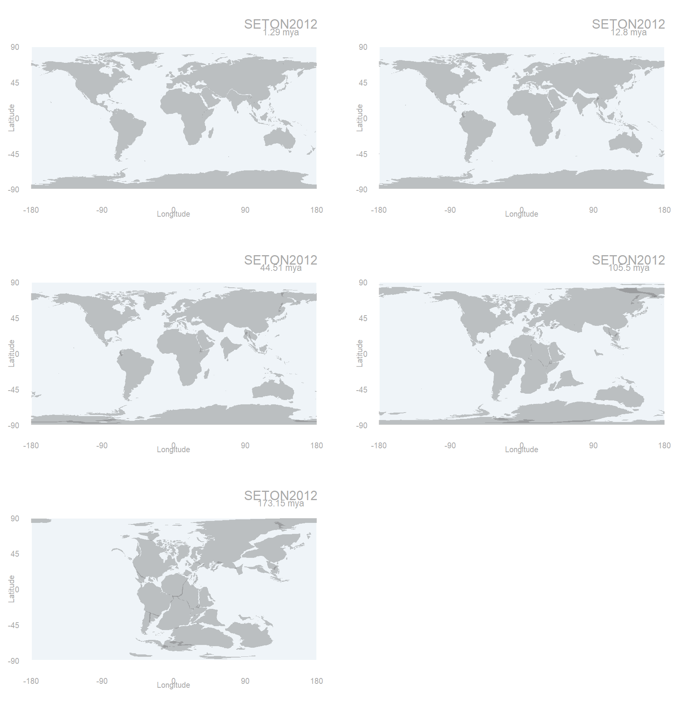
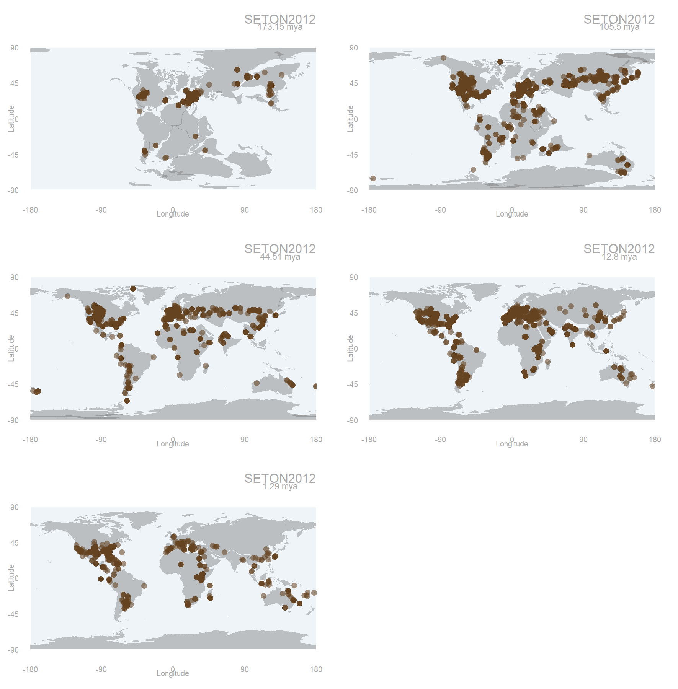
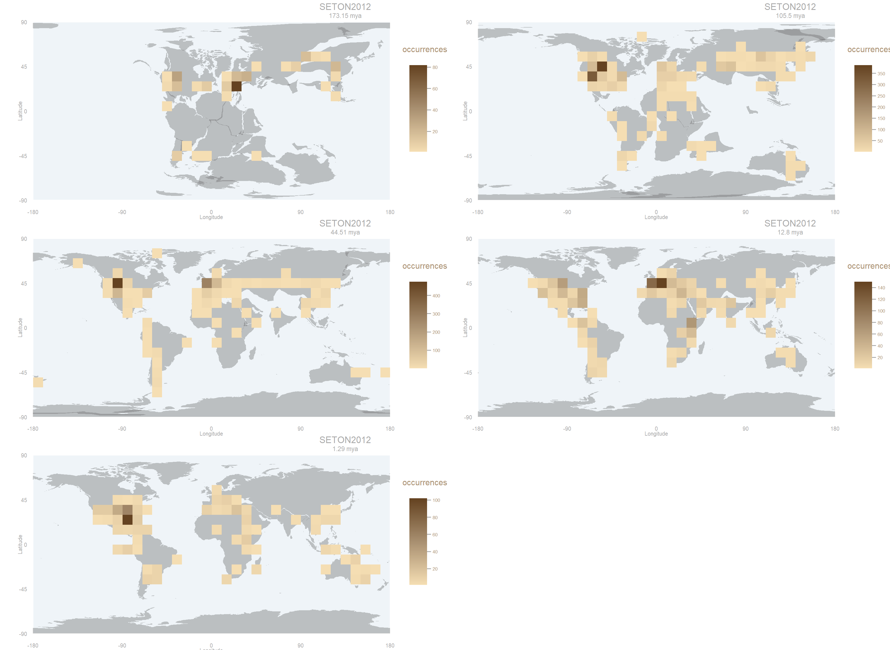
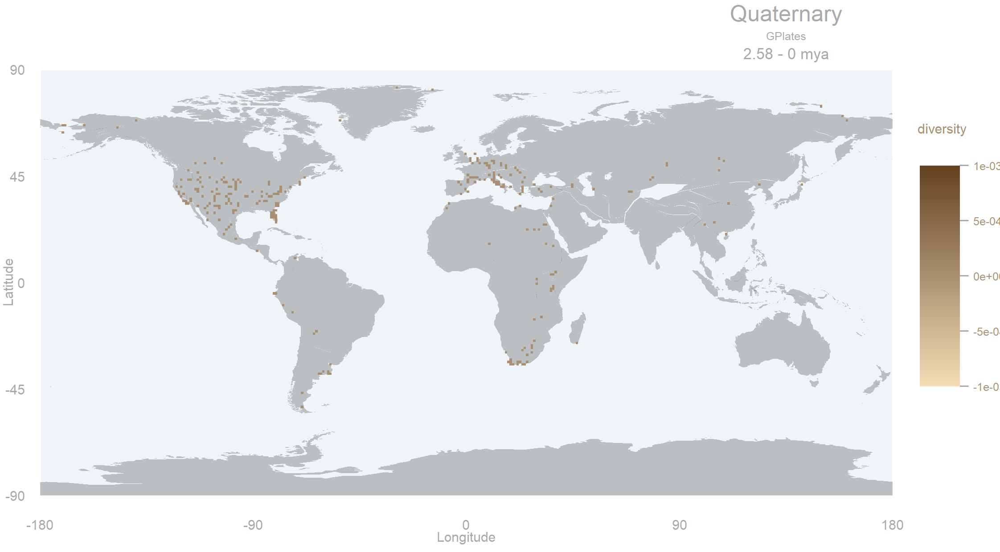

[](https://travis-ci.org/macroecology/mapast)

mapast
=======

### About

`mapast` is a package that combines paleomaps from different models with fossil records from [Paleobiology Database](http://paleobiodb.org/). It can be used to download shapefiles with reconstructions of the past configuration of the continents, and to generate paleodiversity maps.
Available models can be found at https://github.com/GPlates/gplates_web_service_doc/wiki/Reconstruction-Models .

### Quick start

**Install**

Install mapast from CRAN (not on CRAN yet)

```coffee
install.packages("mapast")
library(mapast)
```

Install mapast developing version from github

```coffee
install.packages("devtools")
library(devtools)
install_github("macroecology/mapast")
library(mapast)
```

**General overview**

`mapast` version 0.1 has 3 functions for getting and visualising paleogeographical maps and fossil data, 4 functions for constructing diversity rasters (paleorichness and Shannon paleodiversity) and 2 functions for creating diversity matrix (based on localities or cells) and 2 functions for getting latitudinal paleodiversity gradients.

## Get and visualise paleogeograhical maps and fossil data

**formatdata**
returns a data.frame with the data from the Paleobiology Database in the correct format for further analysis.

```coffee
> data  <-  base::data.frame(paleobioDB::pbdb_occurrences(limit = "all", 
+                                                         base_name = "testudinata", 
+                                                         min_ma = 0, max_ma = 201.3, 
+                                                         show = c("coords", "phylo"), 
+                                                         vocab = "pbdb"))
> head(data)
    occurrence_no record_type reid_no collection_no                 taxon_name taxon_rank taxon_no         matched_name
1:1         30259  occurrence   29799          2225             Tropidemys sp.      genus    37701           Tropidemys
1:2         30260  occurrence      NA          2225 Trachyaspis sanctae-crucis    species    37663          Trachyaspis
1:3         40165  occurrence      NA          3113        Peritresius ornatus    species   173397  Peritresius ornatus
1:4         40166  occurrence      NA          3113       Rhetechelys platyops    species   128351 Rhetechelys platyops
1:5         41525  occurrence      NA          3257                Chelone sp.      genus    80566              Chelone
1:6         41581  occurrence      NA          3256                Chelone sp.      genus    80566              Chelone
    matched_rank matched_no early_interval early_age late_age reference_no        lng      lat       genus genus_no
1:1        genus      37701    Valanginian     139.8    132.9  50311;50311   6.516667 46.83333  Tropidemys    37701
1:2        genus      37663    Valanginian     139.8    132.9        66;66   6.516667 46.83333 Trachyaspis    37663
1:3      species     173397      Thanetian      59.2     56.0      140;140 -74.683334 39.97194 Peritresius    36360
1:4      species     128351      Thanetian      59.2     56.0      140;140 -74.683334 39.97194 Rhetechelys   128349
1:5        genus      80566   Early Eocene      55.8     37.2      149;149  -1.166667 51.08333     Chelone    80566
1:6        genus      80566   Early Eocene      55.8     37.2      149;149  -1.166667 51.08333     Chelone    80566
             family family_no      order order_no    class class_no   phylum phylum_no late_interval
1:1 Plesiochelyidae     37686 Testudines    56475 Reptilia    36322 Chordata     33815          <NA>
1:2     Cheloniidae     37695 Testudines    56475 Reptilia    36322 Chordata     33815          <NA>
1:3     Chelydridae     37704 Testudines    56475 Reptilia    36322 Chordata     33815          <NA>
1:4  Pancheloniidae    165650 Testudines    56475 Reptilia    36322 Chordata     33815          <NA>
1:5    Testudinidae     37739 Testudines    56475 Reptilia    36322 Chordata     33815 Middle Eocene
1:6    Testudinidae     37739 Testudines    56475 Reptilia    36322 Chordata     33815 Middle Eocene

> df <- formatdata(data)
> head(df)
       occurrence_no record_type reid_no collection_no                        taxon_name taxon_rank taxon_no
1:3059        829847  occurrence      NA         52986                   Helcura caudata    species   156017
1:3060        829848  occurrence      NA         52986            Helcura surgens n. sp.    species   156018
1:3061        829849  occurrence      NA         52986           Helcura anguinea n. sp.    species   156015
1:1929        520205  occurrence      NA         52994          Ancyropus heteroclitus ?    species   156085
1:1930        520266  occurrence      NA         52996 Amblypus n. gen. dextratus n. sp.    species   156013
1:1931        520268  occurrence      NA         52996                  Helcura anguinea    species   156015
                 matched_name matched_rank matched_no early_interval early_age late_age reference_no       lng      lat     genus
1:3059     Helcura littoralis      species     156016     Hettangian     201.3    199.3  29531;29531 -72.53095 42.60677   Helcura
1:3060        Helcura surgens      species     156018     Hettangian     201.3    199.3  29531;29531 -72.53095 42.60677   Helcura
1:3061       Helcura anguinea      species     156015     Hettangian     201.3    199.3  29531;29531 -72.53095 42.60677   Helcura
1:1929 Ancyropus heteroclitus      species     156085     Hettangian     201.3    190.8  30862;30862 -72.55917 42.28056 Ancyropus
1:1930     Amblypus dextratus      species     156013     Hettangian     201.3    190.8  15230;15230 -72.55286 42.61120  Amblypus
1:1931       Helcura anguinea      species     156015     Hettangian     201.3    190.8  29531;29531 -72.55286 42.61120   Helcura
       genus_no family family_no order order_no    class class_no   phylum phylum_no late_interval                species avg_age
1:3059   156014   <NA>        NA  <NA>       NA Reptilia    36322 Chordata     33815          <NA>     Helcura littoralis  200.30
1:3060   156014   <NA>        NA  <NA>       NA Reptilia    36322 Chordata     33815          <NA>        Helcura surgens  200.30
1:3061   156014   <NA>        NA  <NA>       NA Reptilia    36322 Chordata     33815          <NA>       Helcura anguinea  200.30
1:1929   156007   <NA>        NA  <NA>       NA Reptilia    36322 Chordata     33815    Sinemurian Ancyropus heteroclitus  196.05
1:1930   156012   <NA>        NA  <NA>       NA Reptilia    36322 Chordata     33815    Sinemurian     Amblypus dextratus  196.05
1:1931   156014   <NA>        NA  <NA>       NA Reptilia    36322 Chordata     33815    Sinemurian       Helcura anguinea  196.05
```

**paleocoords**
Function getting the paleocoordinates of the fossils which are calculated with the model the user chooses.

```coffee
> df_coords_SETON2012 <- paleocoords(data = df, time = "timevector", 
+                                    timevector = c(0, 2.58, 23.02, 66, 145, 201.3), 
+                                    model = "SETON2012")
[1] "You can not plot all of these points in a single map. You have 5 different maps, which are  173.15mya , 105.5mya , 44.51mya , 12.8mya , 1.29mya ."
> head(df_coords_SETON2012)
       occurrence_no record_type reid_no collection_no                        taxon_name taxon_rank taxon_no
1:3059        829847  occurrence      NA         52986                   Helcura caudata    species   156017
1:3060        829848  occurrence      NA         52986            Helcura surgens n. sp.    species   156018
1:3061        829849  occurrence      NA         52986           Helcura anguinea n. sp.    species   156015
1:1929        520205  occurrence      NA         52994          Ancyropus heteroclitus ?    species   156085
1:1930        520266  occurrence      NA         52996 Amblypus n. gen. dextratus n. sp.    species   156013
1:1931        520268  occurrence      NA         52996                  Helcura anguinea    species   156015
                 matched_name matched_rank matched_no early_interval early_age late_age reference_no       lng      lat     genus
1:3059     Helcura littoralis      species     156016     Hettangian     201.3    199.3  29531;29531 -72.53095 42.60677   Helcura
1:3060        Helcura surgens      species     156018     Hettangian     201.3    199.3  29531;29531 -72.53095 42.60677   Helcura
1:3061       Helcura anguinea      species     156015     Hettangian     201.3    199.3  29531;29531 -72.53095 42.60677   Helcura
1:1929 Ancyropus heteroclitus      species     156085     Hettangian     201.3    190.8  30862;30862 -72.55917 42.28056 Ancyropus
1:1930     Amblypus dextratus      species     156013     Hettangian     201.3    190.8  15230;15230 -72.55286 42.61120  Amblypus
1:1931       Helcura anguinea      species     156015     Hettangian     201.3    190.8  29531;29531 -72.55286 42.61120   Helcura
       genus_no family family_no order order_no    class class_no   phylum phylum_no late_interval                species avg_age
1:3059   156014   <NA>        NA  <NA>       NA Reptilia    36322 Chordata     33815          <NA>     Helcura littoralis  200.30
1:3060   156014   <NA>        NA  <NA>       NA Reptilia    36322 Chordata     33815          <NA>        Helcura surgens  200.30
1:3061   156014   <NA>        NA  <NA>       NA Reptilia    36322 Chordata     33815          <NA>       Helcura anguinea  200.30
1:1929   156007   <NA>        NA  <NA>       NA Reptilia    36322 Chordata     33815    Sinemurian Ancyropus heteroclitus  196.05
1:1930   156012   <NA>        NA  <NA>       NA Reptilia    36322 Chordata     33815    Sinemurian     Amblypus dextratus  196.05
1:1931   156014   <NA>        NA  <NA>       NA Reptilia    36322 Chordata     33815    Sinemurian       Helcura anguinea  196.05
       recon_age paleolng paleolat
1:3059    173.15    -9.79    23.44
1:3060    173.15    -9.79    23.44
1:3061    173.15    -9.79    23.44
1:1929    173.15    -9.90    23.13
1:1930    173.15    -9.80    23.45
1:1931    173.15    -9.80    23.45
```

**getmap** 
returns a SpatialPolygonsDataFrame or a list of SpatialPolygonsDataFrames of the maps of the requested model.

```coffee
> maps_SETON2012 <- getmap(ma = c(1.29, 12.80, 44.51, 105.50, 173.15), model = "SETON2012")
> maps_SETON2012
[[1]]
class       : SpatialPolygonsDataFrame 
features    : 597 
extent      : -180, 180, -90, 83.44  (xmin, xmax, ymin, ymax)
coord. ref. : +proj=longlat +datum=WGS84 +no_defs +ellps=WGS84 +towgs84=0,0,0 
variables   : 3
names       : FID,  age,     model 
min values  :   0, 1.29, SETON2012 
max values  : 596, 1.29, SETON2012 

[[2]]
class       : SpatialPolygonsDataFrame 
features    : 574 
extent      : -180, 180, -90, 82.42  (xmin, xmax, ymin, ymax)
coord. ref. : +proj=longlat +datum=WGS84 +no_defs +ellps=WGS84 +towgs84=0,0,0 
variables   : 3
names       : FID,  age,     model 
min values  :   0, 12.8, SETON2012 
max values  : 573, 12.8, SETON2012 

[[3]]
class       : SpatialPolygonsDataFrame 
features    : 539 
extent      : -180, 180, -90, 84.24  (xmin, xmax, ymin, ymax)
coord. ref. : +proj=longlat +datum=WGS84 +no_defs +ellps=WGS84 +towgs84=0,0,0 
variables   : 3
names       : FID,   age,     model 
min values  :   0, 44.51, SETON2012 
max values  : 538, 44.51, SETON2012 

[[4]]
class       : SpatialPolygonsDataFrame 
features    : 468 
extent      : -180, 180, -90, 87.61  (xmin, xmax, ymin, ymax)
coord. ref. : +proj=longlat +datum=WGS84 +no_defs +ellps=WGS84 +towgs84=0,0,0 
variables   : 3
names       : FID,   age,     model 
min values  :   0, 105.5, SETON2012 
max values  : 467, 105.5, SETON2012 

[[5]]
class       : SpatialPolygonsDataFrame 
features    : 403 
extent      : -180, 180, -88.36, 89.2  (xmin, xmax, ymin, ymax)
coord. ref. : +proj=longlat +datum=WGS84 +no_defs +ellps=WGS84 +towgs84=0,0,0 
variables   : 3
names       : FID,    age,     model 
min values  :   0, 173.15, SETON2012 
max values  : 402, 173.15, SETON2012 
```



**mapast**
Returns a plot with the fossil occurrences plotted on their corresponding paleogeographical map.

```coffee
> data  <-  base::data.frame(paleobioDB::pbdb_occurrences(limit = "all", 
+                                                         base_name = "testudinata", 
+                                                         min_ma = 0, max_ma = 201.3, 
+                                                         show = c("coords", "phylo"), 
+                                                         vocab = "pbdb"))
> #format the data so it has the columns needed for further analysis
> df <- formatdata(data)
> 
> #get the coordinates
> df_coords_SETON2012 <- paleocoords(data = df, time = "timevector", 
+                                    timevector = c(0, 2.58, 23.02, 66, 145, 201.3), 
+                                    model = "SETON2012")
[1] "You can not plot all of these points in a single map. You have 5 different maps, which are  173.15mya , 105.5mya , 44.51mya , 12.8mya , 1.29mya ."

> mapast(data = df_coords_SETON2012, map = maps_SETON2012)
```



## Functions for paleogeographical analyses

**mapocc**
Returns a RasterLayer of the sampling effort and a map with the raster on it.

```coffee
> data  <-  base::data.frame(paleobioDB::pbdb_occurrences(limit = "all", 
+                                                         base_name = "testudinata", 
+                                                         min_ma = 0, max_ma = 201.3, 
+                                                         show = c("coords", "phylo"), 
+                                                         vocab = "pbdb"))
> #format the data so it has the columns needed for further analysis
> df <- formatdata(data)
> 
> #get the coordinates
> df_coords_SETON2012 <- paleocoords(data = df, time = "timevector", 
+                                    timevector = c(0, 2.58, 23.02, 66, 145, 201.3), 
+                                    model = "SETON2012")
[1] "You can not plot all of these points in a single map. You have 5 different maps, which are  173.15mya , 105.5mya , 44.51mya , 12.8mya , 1.29mya ."

> mapocc_SETON2012 <- mapocc(df_coords_SETON2012, model = "SETON2012", rank = "genus", map = maps_SETON2012, res = 10)
> mapocc_SETON2012
class       : RasterStack 
dimensions  : 18, 36, 648, 5  (nrow, ncol, ncell, nlayers)
resolution  : 10, 10  (x, y)
extent      : -180, 180, -90, 90  (xmin, xmax, ymin, ymax)
coord. ref. : NA 
names       : layer.1, layer.2, layer.3, layer.4, layer.5 
min values  :       1,       1,       1,       1,       1 
max values  :      82,     387,     475,     150,     102 
``` 


 

**maprich**
Returns a RasterLayer of richness and a map with the raster on it.

```coffee

> maprich (shape, data, rank="species")


```

 

## Paleodiversity

**spsite**
Returns a dataframe of taxa occurrences vs. localities (unity="fossilsite) or cells(unity="cell") (~ sites/cells per taxa matrix)

```coffee
> data <- getdata(base_name = "Canis", interval = "Quaternary")
> result <- spsite(data, unity="fossilsite", rank = "genus")
> head(result)
``` 

```coffee
    paleolng paleolat Canis
612  -170.38    63.70     1
611  -170.05    66.03     1
610  -169.90    66.05     1
69   -161.94    66.88     1
83   -147.67    65.10     2
160  -140.00    68.20     1
``` 

```coffee
> data <- getdata(base_name = "Canis", interval = "Quaternary")
> result_cell <- spsite(data, unity="cell", rank = "genus")
> head(result)
``` 

```coffee
      paleolng paleolat Canis
64441   -179.5     89.5     0
64081   -179.5     88.5     0
63721   -179.5     87.5     0
63361   -179.5     86.5     0
63001   -179.5     85.5     0
62641   -179.5     84.5     0
```


**mapdiv**
1- calculates the Shannon diversity per unique locality (based on its coordinates),
2- makes a raster file and a plot showing mean, max, min diversity per cell, 
or number of unique localities per cell

```coffee
> data<- getdata (base_name="Canis", interval="Quaternary")
> div_site <- mapdiv (shape, data, unity="fossilsite", rank="genus", res=1)
``` 

```coffee
class       : RasterLayer 
dimensions  : 180, 360, 64800  (nrow, ncol, ncell)
resolution  : 1, 1  (x, y)
extent      : -180, 180, -90, 90  (xmin, xmax, ymin, ymax)
coord. ref. : NA 
data source : in memory
names       : layer 
values      : NA, NA  (min, max)
``` 
 

```coffee
> data<- getdata (base_name="Canis", interval="Quaternary")
> div_cell <- mapdiv (shape, data, unity="cell", rank="genus", res=1)
``` 

```coffee
class       : RasterLayer 
dimensions  : 180, 360, 64800  (nrow, ncol, ncell)
resolution  : 1, 1  (x, y)
extent      : -180, 180, -90, 90  (xmin, xmax, ymin, ymax)
coord. ref. : NA 
data source : in memory
names       : layer 
values      : NA, NA  (min, max)

``` 

 


**latdivgrad**
 calculates latitudinal diversity (either shannon or richness) of taxa (species, genera, families, orders)

```coffee
> shape<- getmap(interval="Quaternary", model="GPlates", do.plot=FALSE)
> data<- getdata (base_name="Canis", interval="Quaternary")
> rich <- latdivgrad (shape, data, method="richness", rank = "genus", res=1)
> head(rich)
```
```coffee
    paleolat div
180     89.5   0
179     88.5   0
178     87.5   0
177     86.5   0
176     85.5   0
175     84.5   0
```

 

```coffee
> shape<- getmap(interval="Quaternary", model="GPlates", do.plot=FALSE)
> data<- getdata (base_name="Canis", interval="Quaternary")
> shannon <- latdivgrad (shape, data, method="shannon", rank = "species", res=1)
> head(shannon)
```

```coffee
    paleolat div
180     89.5   0
179     88.5   0
178     87.5   0
177     86.5   0
176     85.5   0
175     84.5   0
```

 


## Meta

Please report any [issues or  bugs](https://github.com/macroecology/mapast/issues).

License: GPL-2

To cite package `mapast` in publications use:

```coffee
To cite package `mapast` in publications use:

Sara Varela, K. Sonja Rothkugel (2017). mapast:  combine paleogeography and paleobiodiversity. R package version 0.1. https://github.com/macroecology/mapast

A BibTeX entry for LaTeX users is

  @Manual{,
    title = {mapast:  combine paleogeography and paleobiodiversity},
    author = {Sara Varela} and {Sonja Rothkugel},
    year = {2016},
    note = {R package version 0.1},
    base = {https://github.com/macroecology/mapast},
  }
```

---
