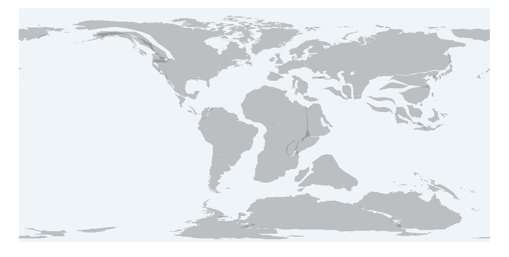
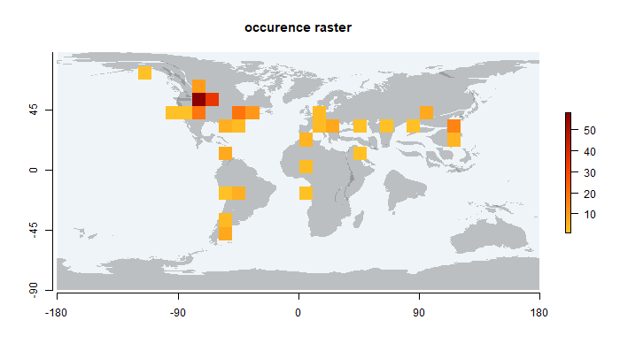
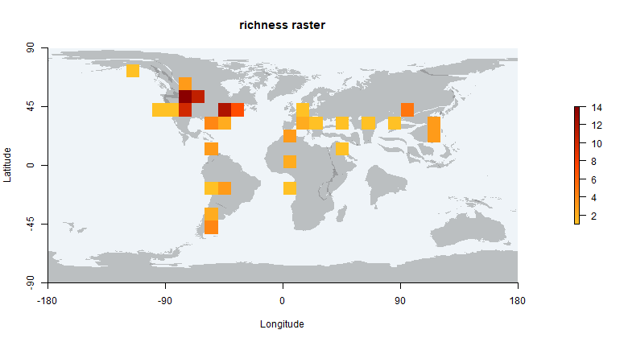
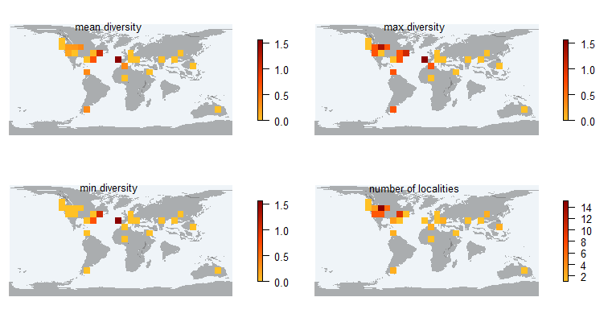
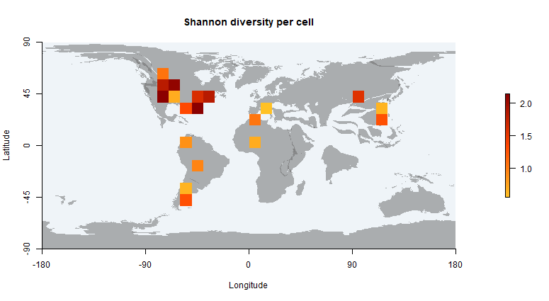
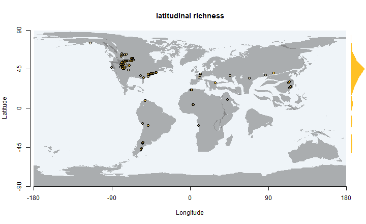
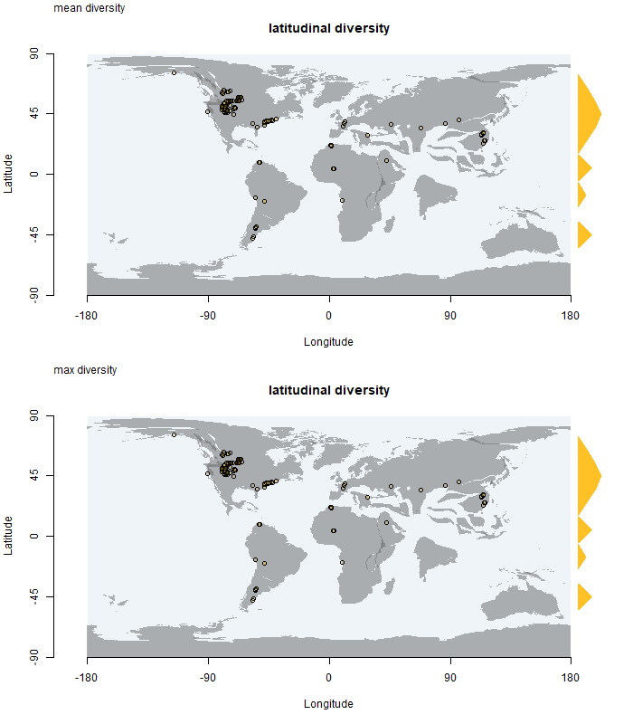

[](https://travis-ci.org/macroecology/paleoMap)

paleoMap
=======

### About

`paleoMap` is a package that combines paleomaps from [GPlates](http://www.gplates.org/), Smith and Golonka with fossil records from [Paleobiology Database](http://paleobiodb.org/). It can be used to download shapefiles with reconstructions of the past configuration of the continents, and to generate paleodiversity maps.

### Quick start

**Install**

Install paleoMap from CRAN

```coffee
install.packages("paleoMap")
library(paleoMap)
```

Install paleoMap developing version from github

```coffee
install.packages("devtools")
library(devtools)
install_github("macroecology/paleoMap")
library(paleoMap)
```

**General overview**

`paleoMap` version 0.1 has 3 functions for getting and visualising paleogeographical maps and fossil data, 4 functions for constructing diversity rasters (paleorichness and Shannon paleodiversity) and 2 functions for creating diversity matrix (based on localities or cells) and 2 functions for getting latitudinal paleodiversity gradients.

## Get and visualise paleogeograhical maps and fossil data

**pm_getmap** 
returns the shapefile of a choosen paleogeographical time interval and a plot

```coffee
> shape  <-  pm_getmap(interval="Cretaceous", model="GPlates")
> shape
```

```coffee
class       : SpatialPolygonsDataFrame 
features    : 86 
extent      : -180, 180, -88.8737, 83.6951  (xmin, xmax, ymin, ymax)
coord. ref. : NA 
variables   : 3
names       : FROMAGE, TOAGE,       NAME 
min values  :     145,    66, Cretaceous 
max values  :     145,    66, Cretaceous 
```



**pm_getdata**
returns a dataframe with the selected fossil occurrences, downloaded from the [Paleobiology Database](http://paleobiodb.org/)

```coffee

> data  <-  pm_getdata (base_name="Testudines", interval="Paleocene")
> head(data)

```

```coffee
  occurrence_no         matched_name   matched_rank matched_no     early_interval   late_interval paleolng paleolat geoplate
1         40165  Peritresius ornatus        species     173397          Thanetian            <NA>   -44.51    40.13      109
2         40166 Rhetechelys platyops        species     128351          Thanetian            <NA>   -44.51    40.13      109
3        149344   Trionyx virginiana        species     231917          Thanetian            <NA>   -47.60    38.76      109
4        205060  Judithemys backmani        species     253836          Paleocene            <NA>   -67.18    57.12      101
5        205061         Trionychinae unranked clade     276091          Paleocene            <NA>   -67.18    57.12      101
6        281674 Taphrosphys sulcatus        species     131500 Late Maastrichtian Early Paleocene   -39.82    40.92      109
        genus          family      order    class   phylum genus_no family_no order_no class_no phylum_no
1 Peritresius     Chelydridae Testudines Reptilia Chordata    36360     37704    56475    36322     33815
2 Rhetechelys  Pancheloniidae Testudines Reptilia Chordata   128349    165650    56475    36322     33815
3        <NA> Pantrionychidae Testudines Reptilia Chordata       NA    361334    56475    36322     33815
4  Judithemys   Macrobaenidae Testudines Reptilia Chordata    56471     56472    56475    36322     33815
5        <NA>    Trionychidae Testudines Reptilia Chordata       NA     37674    56475    36322     33815
6 Taphrosphys   Bothremydidae Testudines Reptilia Chordata    37608     67318    56475    36322     33815

```

**pm_plot**

Returns a plot with the paleomap and the fossil occurrences.

```coffee

data  <-  pm_getdata (base_name="Testudines", 
                      interval="Paleocene")
pm_plot (interval="Paleocene", model="GPlates", data)

```


## Functions for paleogeographical analyses

**pm_occraster**
Returns a RasterLayer of the sampling effort and a map with the raster on it.

```coffee
> shape <- pm_getmap(interval="Paleocene", model="GPlates") 
> data <- pm_getdata (base_name="Testudines", 
                    interval="Paleocene")
> pm_occraster (shape, data, rank="species")

``` 

```coffee
class       : RasterLayer 
dimensions  : 18, 36, 648  (nrow, ncol, ncell)
resolution  : 10, 10  (x, y)
extent      : -180, 180, -92.0605, 87.9395  (xmin, xmax, ymin, ymax)
coord. ref. : NA 
data source : in memory
names       : layer 
values      : 1, 58  (min, max)

```

 

**pm_richraster**
Returns a RasterLayer of richness and a map with the raster on it.

```coffee

> pm_richraster (shape, data, rank="species")

``` 

```coffee
class       : RasterLayer 
dimensions  : 18, 36, 648  (nrow, ncol, ncell)
resolution  : 10, 10  (x, y)
extent      : -180, 180, -92.0605, 87.9395  (xmin, xmax, ymin, ymax)
coord. ref. : NA 
data source : in memory
names       : layer 
values      : 1, 14  (min, max)

```

 

## Paleodiversity

**pm_occ**
Returns a dataframe of taxa occurrences vs. localities (~ sites per taxa matrix)

```coffee
> occ <- pm_occ (data, rank="species")
> str (occ)
``` 

```coffee
'data.frame':	112 obs. of  90 variables:
 $ paleolat                  : num  40.1 38.8 57.1 40.9 53.8 ...
 $ paleolng                  : num  -44.5 -47.6 -67.2 -39.8 -76 ...
 $ Peritresius ornatus       : num  1 0 0 1 0 0 0 0 0 0 ...
 $ Rhetechelys platyops      : num  1 0 0 0 0 0 0 0 0 0 ...
 $ Trionyx virginiana        : num  0 1 0 0 0 0 0 0 0 0 ...
 $ Judithemys backmani       : num  0 0 1 0 0 0 0 0 0 0 ...
 $ Taphrosphys sulcatus      : num  0 0 0 2 0 0 0 0 0 0 ...
 $ Adocus beatus             : num  0 0 0 1 0 0 0 0 0 0 ...
 $ Agomphus pectoralis       : num  0 0 0 1 0 0 0 0 0 0 ...
 $ Catapleura repanda        : num  0 0 0 1 0 0 0 0 0 0 ...
 $ Osteopygis emarginatus    : num  0 0 0 1 0 0 0 0 0 0 ...
 $ Cardichelyon rogerwoodi   : num  0 0 0 0 1 1 0 0 0 0 ...
 $ Arabemys crassiscutata    : num  0 0 0 0 0 0 1 0 0 0 ...
 $ Roxochelys vilavilensis   : num  0 0 0 0 0 0 0 1 0 0 ...
 $ Protochelydra zangerli    : num  0 0 0 0 0 0 0 0 1 0 ...
 $ Compsemys victa           : num  0 0 0 0 0 0 0 0 0 1 ...
 $ Palatobaena bairdi        : num  0 0 0 0 0 0 0 0 0 0 ...
 $ Allaeochelys lingnanica   : num  0 0 0 0 0 0 0 0 0 0 ...
 $ Agomphus oxysternum       : num  0 0 0 0 0 0 0 0 0 0 ...
 $ Trionyx singularis        : num  0 0 0 0 0 0 0 0 0 0 ...
 $ Araiochelys hirayamai     : num  0 0 0 0 0 0 0 0 0 0 ...
 $ Bothremys maghrebiana     : num  0 0 0 0 0 0 0 0 0 0 ...
 $ Bothremys kellyi          : num  0 0 0 0 0 0 0 0 0 0 ...
 $ Taphrosphys ippolitoi     : num  0 0 0 0 0 0 0 0 0 0 ...
 $ Taphrosphys congolensis   : num  0 0 0 0 0 0 0 0 0 0 ...
 $ Rhothonemys brinkmani     : num  0 0 0 0 0 0 0 0 0 0 ...
 $ Azabbaremys moragjonesi   : num  0 0 0 0 0 0 0 0 0 0 ...
 $ Agomphus alabamensis      : num  0 0 0 0 0 0 0 0 0 0 ...
 $ Cerrejonemys wayuunaiki   : num  0 0 0 0 0 0 0 0 0 0 ...
 $ Acleistochelys maliensis  : num  0 0 0 0 0 0 0 0 0 0 ...
 $ Itilochelys rasstrigin    : num  0 0 0 0 0 0 0 0 0 0 ...
 $ Yaminuechelys maior       : num  0 0 0 0 0 0 0 0 0 0 ...
 $ Naiadochelys patagonica   : num  0 0 0 0 0 0 0 0 0 0 ...
 $ Axestemys quinni          : num  0 0 0 0 0 0 0 0 0 0 ...
 $ Cedrobaena putorius       : num  0 0 0 0 0 0 0 0 0 0 ...
 $ Euclastes acutirostris    : num  0 0 0 0 0 0 0 0 0 0 ...
 $ Eosphargis insularis      : num  0 0 0 0 0 0 0 0 0 0 ...
 $ Osteopygis roundsi        : num  0 0 0 0 0 0 0 0 0 0 ...
 $ Tasbacka ruhoffi          : num  0 0 0 0 0 0 0 0 0 0 ...
 $ Mongolemys turfanensis    : num  0 0 0 0 0 0 0 0 0 0 ...
 $ Chisternon interpositum   : num  0 0 0 0 0 0 0 0 0 0 ...
 $ Labrostochelys galkini    : num  0 0 0 0 0 0 0 0 0 0 ...
 $ Baena escavada            : num  0 0 0 0 0 0 0 0 0 0 ...
 $ Alamosemys substricta     : num  0 0 0 0 0 0 0 0 0 0 ...
 $ Hoplochelys crassa        : num  0 0 0 0 0 0 0 0 0 0 ...
 $ Trionyx admirabilis       : num  0 0 0 0 0 0 0 0 0 0 ...
 $ Puentemys mushaisaensis   : num  0 0 0 0 0 0 0 0 0 0 ...
 $ Brachyopsemys tingitana   : num  0 0 0 0 0 0 0 0 0 0 ...
 $ Berruchelus russelli      : num  0 0 0 0 0 0 0 0 0 0 ...
 $ Hutchemys rememdium       : num  0 0 0 0 0 0 0 0 0 0 ...
 $ Euclastes wielandi        : num  0 0 0 0 0 0 0 0 0 0 ...
 $ Carbonemys cofrinii       : num  0 0 0 0 0 0 0 0 0 0 ...
 $ Dortoka botanica          : num  0 0 0 0 0 0 0 0 0 0 ...
 $ Podocnemis brasiliensis   : num  0 0 0 0 0 0 0 0 0 0 ...
 $ Goleremys mckennai        : num  0 0 0 0 0 0 0 0 0 0 ...
 $ Paramongolemys khosatzkyi : num  0 0 0 0 0 0 0 0 0 0 ...
 $ Anhuichelys tsienshanensis: num  0 0 0 0 0 0 0 0 0 0 ...
 $ Anhuichelys doumuensis    : num  0 0 0 0 0 0 0 0 0 0 ...
 $ Anhuichelys siaoshihensis : num  0 0 0 0 0 0 0 0 0 0 ...
 $ Elkemys australis         : num  0 0 0 0 0 0 0 0 0 0 ...
 $ Hokouchelys chenshuensis  : num  0 0 0 0 0 0 0 0 0 0 ...
 $ Euclastes meridionalis    : num  0 0 0 0 0 0 0 0 0 0 ...
 $ Axestemys montinsana      : num  0 0 0 0 0 0 0 0 0 0 ...
 $ Tasbacka ouledabdounensis : num  0 0 0 0 0 0 0 0 0 0 ...
 $ Lapparentemys vilavilensis: num  0 0 0 0 0 0 0 0 0 0 ...
 $ Tasbacka aldabergeni      : num  0 0 0 0 0 0 0 0 0 0 ...
 $ Judithemys kranzi         : num  0 0 0 0 0 0 0 0 0 0 ...
 $ Trionyx halophilus        : num  0 0 0 0 0 0 0 0 0 0 ...
 $ Aspideretoides superstes  : num  0 0 0 0 0 0 0 0 0 0 ...
 $ Tullochelys montana       : num  0 0 0 0 0 0 0 0 0 0 ...
 $ Stygiochelys estesi       : num  0 0 0 0 0 0 0 0 0 0 ...
 $ Kuhnemys palaeocenica     : num  0 0 0 0 0 0 0 0 0 0 ...
 $ Mongolemys reshetovi      : num  0 0 0 0 0 0 0 0 0 0 ...
 $ Hydromedusa casamayorensis: num  0 0 0 0 0 0 0 0 0 0 ...
 $ Chelodina alanrixi        : num  0 0 0 0 0 0 0 0 0 0 ...
 $ Hutchemys sterea          : num  0 0 0 0 0 0 0 0 0 0 ...
 $ Hutchemys tetanetron      : num  0 0 0 0 0 0 0 0 0 0 ...
 $ Denverus middletoni       : num  0 0 0 0 0 0 0 0 0 0 ...
 $ Plesiobaena antiqua       : num  0 0 0 0 0 0 0 0 0 0 ...
 $ Neurankylus torrejonensis : num  0 0 0 0 0 0 0 0 0 0 ...
 $ Taphrosphys ambiguus      : num  0 0 0 0 0 0 0 0 0 0 ...
 $ Planetochelys savoiei     : num  0 0 0 0 0 0 0 0 0 0 ...
 $ Axestemys vittata         : num  0 0 0 0 0 0 0 0 0 0 ...
 $ Salamanchelys palaeocenica: num  0 0 0 0 0 0 0 0 0 0 ...
 $ Trionyx eloisae           : num  0 0 0 0 0 0 0 0 0 0 ...
 $ Trionyx reesidei          : num  0 0 0 0 0 0 0 0 0 0 ...
 $ Trionyx vegetus           : num  0 0 0 0 0 0 0 0 0 0 ...
 $ Macrobaena mongolica      : num  0 0 0 0 0 0 0 0 0 0 ...
 $ Mongolemys tatarinovi     : num  0 0 0 0 0 0 0 0 0 0 ...
 $ Osteopygis platylomus     : num  0 0 0 0 0 0 0 0 0 0 ...
``` 

**pm_occ_cell**
Returns a dataframe of taxa occurrences vs. cells (aggregation of taxa based on cells and not on localities like pm_occ)

```coffee
> occ_cell<- pm_occ_cell (data, rank="species", res=10)
> str (occ_cell)
``` 

```coffee
'data.frame':	648 obs. of  90 variables:
 $ paleolng                  : num  -175 -165 -155 -145 -135 -125 -115 -105 -95 -85 ...
 $ paleolat                  : num  -85 -85 -85 -85 -85 -85 -85 -85 -85 -85 ...
 $ Peritresius ornatus       : num  0 0 0 0 0 0 0 0 0 0 ...
 $ Rhetechelys platyops      : num  0 0 0 0 0 0 0 0 0 0 ...
 $ Trionyx virginiana        : num  0 0 0 0 0 0 0 0 0 0 ...
 $ Judithemys backmani       : num  0 0 0 0 0 0 0 0 0 0 ...
 $ Taphrosphys sulcatus      : num  0 0 0 0 0 0 0 0 0 0 ...
 $ Adocus beatus             : num  0 0 0 0 0 0 0 0 0 0 ...
 $ Agomphus pectoralis       : num  0 0 0 0 0 0 0 0 0 0 ...
 $ Catapleura repanda        : num  0 0 0 0 0 0 0 0 0 0 ...
 $ Osteopygis emarginatus    : num  0 0 0 0 0 0 0 0 0 0 ...
 $ Cardichelyon rogerwoodi   : num  0 0 0 0 0 0 0 0 0 0 ...
 $ Arabemys crassiscutata    : num  0 0 0 0 0 0 0 0 0 0 ...
 $ Roxochelys vilavilensis   : num  0 0 0 0 0 0 0 0 0 0 ...
 $ Protochelydra zangerli    : num  0 0 0 0 0 0 0 0 0 0 ...
 $ Compsemys victa           : num  0 0 0 0 0 0 0 0 0 0 ...
 $ Palatobaena bairdi        : num  0 0 0 0 0 0 0 0 0 0 ...
 $ Allaeochelys lingnanica   : num  0 0 0 0 0 0 0 0 0 0 ...
 $ Agomphus oxysternum       : num  0 0 0 0 0 0 0 0 0 0 ...
 $ Trionyx singularis        : num  0 0 0 0 0 0 0 0 0 0 ...
 $ Araiochelys hirayamai     : num  0 0 0 0 0 0 0 0 0 0 ...
 $ Bothremys maghrebiana     : num  0 0 0 0 0 0 0 0 0 0 ...
 $ Bothremys kellyi          : num  0 0 0 0 0 0 0 0 0 0 ...
 $ Taphrosphys ippolitoi     : num  0 0 0 0 0 0 0 0 0 0 ...
 $ Taphrosphys congolensis   : num  0 0 0 0 0 0 0 0 0 0 ...
 $ Rhothonemys brinkmani     : num  0 0 0 0 0 0 0 0 0 0 ...
 $ Azabbaremys moragjonesi   : num  0 0 0 0 0 0 0 0 0 0 ...
 $ Agomphus alabamensis      : num  0 0 0 0 0 0 0 0 0 0 ...
 $ Cerrejonemys wayuunaiki   : num  0 0 0 0 0 0 0 0 0 0 ...
 $ Acleistochelys maliensis  : num  0 0 0 0 0 0 0 0 0 0 ...
 $ Itilochelys rasstrigin    : num  0 0 0 0 0 0 0 0 0 0 ...
 $ Yaminuechelys maior       : num  0 0 0 0 0 0 0 0 0 0 ...
 $ Naiadochelys patagonica   : num  0 0 0 0 0 0 0 0 0 0 ...
 $ Axestemys quinni          : num  0 0 0 0 0 0 0 0 0 0 ...
 $ Cedrobaena putorius       : num  0 0 0 0 0 0 0 0 0 0 ...
 $ Euclastes acutirostris    : num  0 0 0 0 0 0 0 0 0 0 ...
 $ Eosphargis insularis      : num  0 0 0 0 0 0 0 0 0 0 ...
 $ Osteopygis roundsi        : num  0 0 0 0 0 0 0 0 0 0 ...
 $ Tasbacka ruhoffi          : num  0 0 0 0 0 0 0 0 0 0 ...
 $ Mongolemys turfanensis    : num  0 0 0 0 0 0 0 0 0 0 ...
 $ Chisternon interpositum   : num  0 0 0 0 0 0 0 0 0 0 ...
 $ Labrostochelys galkini    : num  0 0 0 0 0 0 0 0 0 0 ...
 $ Baena escavada            : num  0 0 0 0 0 0 0 0 0 0 ...
 $ Alamosemys substricta     : num  0 0 0 0 0 0 0 0 0 0 ...
 $ Hoplochelys crassa        : num  0 0 0 0 0 0 0 0 0 0 ...
 $ Trionyx admirabilis       : num  0 0 0 0 0 0 0 0 0 0 ...
 $ Puentemys mushaisaensis   : num  0 0 0 0 0 0 0 0 0 0 ...
 $ Brachyopsemys tingitana   : num  0 0 0 0 0 0 0 0 0 0 ...
 $ Berruchelus russelli      : num  0 0 0 0 0 0 0 0 0 0 ...
 $ Hutchemys rememdium       : num  0 0 0 0 0 0 0 0 0 0 ...
 $ Euclastes wielandi        : num  0 0 0 0 0 0 0 0 0 0 ...
 $ Carbonemys cofrinii       : num  0 0 0 0 0 0 0 0 0 0 ...
 $ Dortoka botanica          : num  0 0 0 0 0 0 0 0 0 0 ...
 $ Podocnemis brasiliensis   : num  0 0 0 0 0 0 0 0 0 0 ...
 $ Goleremys mckennai        : num  0 0 0 0 0 0 0 0 0 0 ...
 $ Paramongolemys khosatzkyi : num  0 0 0 0 0 0 0 0 0 0 ...
 $ Anhuichelys tsienshanensis: num  0 0 0 0 0 0 0 0 0 0 ...
 $ Anhuichelys doumuensis    : num  0 0 0 0 0 0 0 0 0 0 ...
 $ Anhuichelys siaoshihensis : num  0 0 0 0 0 0 0 0 0 0 ...
 $ Elkemys australis         : num  0 0 0 0 0 0 0 0 0 0 ...
 $ Hokouchelys chenshuensis  : num  0 0 0 0 0 0 0 0 0 0 ...
 $ Euclastes meridionalis    : num  0 0 0 0 0 0 0 0 0 0 ...
 $ Axestemys montinsana      : num  0 0 0 0 0 0 0 0 0 0 ...
 $ Tasbacka ouledabdounensis : num  0 0 0 0 0 0 0 0 0 0 ...
 $ Lapparentemys vilavilensis: num  0 0 0 0 0 0 0 0 0 0 ...
 $ Tasbacka aldabergeni      : num  0 0 0 0 0 0 0 0 0 0 ...
 $ Judithemys kranzi         : num  0 0 0 0 0 0 0 0 0 0 ...
 $ Trionyx halophilus        : num  0 0 0 0 0 0 0 0 0 0 ...
 $ Aspideretoides superstes  : num  0 0 0 0 0 0 0 0 0 0 ...
 $ Tullochelys montana       : num  0 0 0 0 0 0 0 0 0 0 ...
 $ Stygiochelys estesi       : num  0 0 0 0 0 0 0 0 0 0 ...
 $ Kuhnemys palaeocenica     : num  0 0 0 0 0 0 0 0 0 0 ...
 $ Mongolemys reshetovi      : num  0 0 0 0 0 0 0 0 0 0 ...
 $ Hydromedusa casamayorensis: num  0 0 0 0 0 0 0 0 0 0 ...
 $ Chelodina alanrixi        : num  0 0 0 0 0 0 0 0 0 0 ...
 $ Hutchemys sterea          : num  0 0 0 0 0 0 0 0 0 0 ...
 $ Hutchemys tetanetron      : num  0 0 0 0 0 0 0 0 0 0 ...
 $ Denverus middletoni       : num  0 0 0 0 0 0 0 0 0 0 ...
 $ Plesiobaena antiqua       : num  0 0 0 0 0 0 0 0 0 0 ...
 $ Neurankylus torrejonensis : num  0 0 0 0 0 0 0 0 0 0 ...
 $ Taphrosphys ambiguus      : num  0 0 0 0 0 0 0 0 0 0 ...
 $ Planetochelys savoiei     : num  0 0 0 0 0 0 0 0 0 0 ...
 $ Axestemys vittata         : num  0 0 0 0 0 0 0 0 0 0 ...
 $ Salamanchelys palaeocenica: num  0 0 0 0 0 0 0 0 0 0 ...
 $ Trionyx eloisae           : num  0 0 0 0 0 0 0 0 0 0 ...
 $ Trionyx reesidei          : num  0 0 0 0 0 0 0 0 0 0 ...
 $ Trionyx vegetus           : num  0 0 0 0 0 0 0 0 0 0 ...
 $ Macrobaena mongolica      : num  0 0 0 0 0 0 0 0 0 0 ...
 $ Mongolemys tatarinovi     : num  0 0 0 0 0 0 0 0 0 0 ...
 $ Osteopygis platylomus     : num  0 0 0 0 0 0 0 0 0 0 ...
``` 


**pm_divraster_loc**
1- calculates the Shannon diversity per unique locality (based on its coordinates),
2- makes a raster file and a plot showing mean, max, min diversity per cell, 
or number of unique localities per cell

```coffee
> occ_df <- pm_occ (data, rank="species")
> pm_divraster_loc (shape, occ_df, fun=mean)
> pm_divraster_loc (shape, occ_df, fun=max)
> pm_divraster_loc (shape, occ_df, fun=min)
> pm_divraster_loc (shape, occ_df, fun="count")


``` 

```coffee
class       : RasterLayer 
dimensions  : 18, 36, 648  (nrow, ncol, ncell)
resolution  : 10, 10  (x, y)
extent      : -180, 180, -92.0605, 87.9395  (xmin, xmax, ymin, ymax)
coord. ref. : NA 
data source : in memory
names       : layer 
values      : 1, 15  (min, max)

``` 

 

**pm_divraster_cell**
calculates the Shannon diversity per cell 
(taking into account relative abundances of all the fossil records whithin the cell)

```coffee
occ_df_cell <- pm_occ_cell (data, rank="species")
pm_divraster_cell (shape, occ_df_cell, res=10)
```
```coffee
class       : RasterLayer 
dimensions  : 18, 36, 648  (nrow, ncol, ncell)
resolution  : 10, 10  (x, y)
extent      : -180, 180, -92.0605, 87.9395  (xmin, xmax, ymin, ymax)
coord. ref. : NA 
data source : in memory
names       : layer 
values      : 0.6365142, 2.059229  (min, max)
```
 


**pm_latrich**
 calculates latitudinal diversity of taxa (species, genera, families, orders)

```coffee
> pm_latrich (shape, data, rank="species", res=10)
```
```coffee
 lat_min lat_max richn
1      -90     -80     0
2      -80     -70     0
3      -70     -60     0
4      -60     -50     0
5      -50     -40     3
6      -40     -30     0
7      -30     -20     0
8      -20     -10     0
9      -10       0     0
10       0      10     3
11      10      20     1
12      20      30     6
13      30      40    17
14      40      50    17
15      50      60    13
16      60      70     0
17      70      80     0
18      80      90     0
```

 

**pm_latdiv**

calculates the Shannon diversity along the latitudinal gradient based on the individual values of diverstiy the fossil localities of those latitudes. The function returns the mean or max values of diversity of the sampled localities along the latitudinal gradient.


```coffee
> occ_df <- pm_occ (data)
> pm_latdiv (occ_df, shape, fun=mean)
> pm_latdiv (occ_df, shape, fun=max)

```

```coffee
   maxlat minlat       div
1     -90    -80 0.0000000
2     -80    -70 0.0000000
3     -70    -60 0.0000000
4     -60    -50 0.0000000
5     -50    -40 0.6931472
6     -40    -30 0.0000000
7     -30    -20 0.0000000
8     -20    -10 0.0000000
9     -10      0 0.0000000
10      0     10 0.6931472
11     10     20 0.0000000
12     20     30 0.6931472
13     30     40 1.5607104
14     40     50 1.3321790
15     50     60 1.0986123
16     60     70 0.0000000
17     70     80 0.0000000
18     80     90 0.0000000
``` 

 


## Meta

Please report any [issues or  bugs](https://github.com/macroecology/paleoMap/issues).

License: GPL-2

To cite package `paleoMap` in publications use:

```coffee
To cite package `paleoMap` in publications use:

Sara Varela, K. Sonja Rothkugel (2017). paleoMap:  combine paleogeography and paleobiodiversity. R package version 0.1. https://github.com/macroecology/paleoMap

A BibTeX entry for LaTeX users is

  @Manual{,
    title = {paleoMap:  combine paleogeography and paleobiodiversity},
    author = {Sara Varela} and {Sonja Rothkugel},
    year = {2016},
    note = {R package version 0.1},
    base = {https://github.com/macroecology/paleoMap},
  }
```

---
